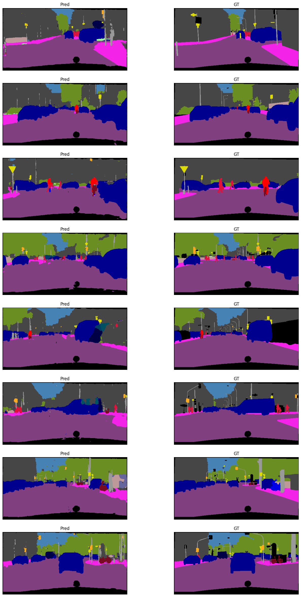

# U-Net Segmentation on Cityscapes Dataset

This project demonstrates training a UNet model for semantic segmentation on the Cityscapes dataset.

## Dataset

The Cityscapes dataset is used in this project. It includes images taken from street scenes in different cities and provides pixel-level annotations for various classes such as roads, sidewalks, buildings, and more.

## Training

The model is trained using the following components:

- Loss Function: **Dice loss**.
- Optimizer: **Adam optimizer**.
- Learning Rate Scheduler: **CosineAnnealingLR**.
- Scaler: For mixed precision training.

Training checkpoints save the model state, optimizer state, scheduler state, and scaler state.

## Results

